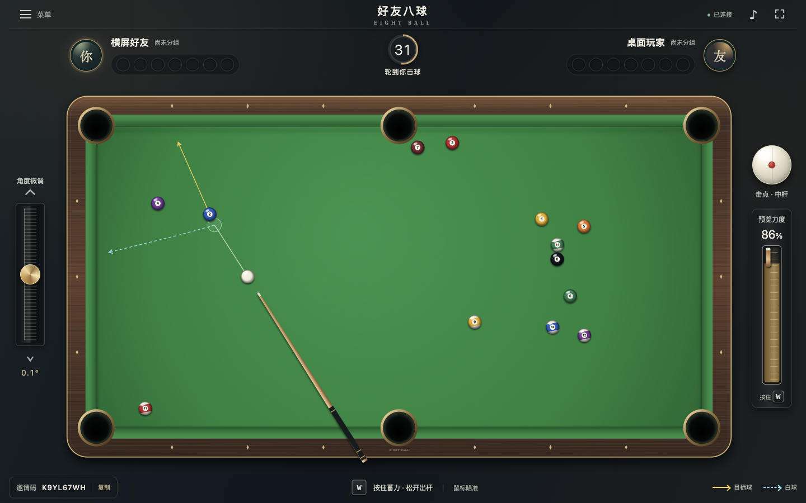
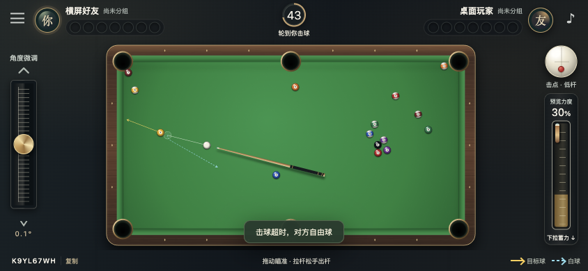
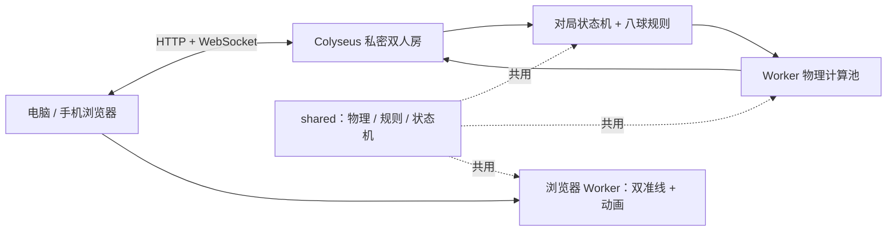

<div align="center">

# 好友八球 · Eight Ball

**看清目标球的去向，也看清白球的下一步。**

电脑与手机横屏的八球游戏 · 双准线 · 高低杆 · 自托管好友对战

[**立即试玩 ↗**](https://hexing-ai.github.io/eight-ball-web/) · [3 分钟运行](#3-分钟运行) · [架构](docs/ARCHITECTURE.md) · [English](README.en.md)

[](https://github.com/hexing-ai/eight-ball-web/actions/workflows/ci.yml)


</div>

[](https://hexing-ai.github.io/eight-ball-web/)

> **在线 Demo 是同屏双人模式**：两人共用一台设备，轮流击球，无需账号和服务器。GitHub Pages 不运行 WebSocket 后端。邀请异地好友需要运行本项目的 Node.js 后端，见[部署指南](docs/DEPLOYMENT.md)。上图为实际联网版运行截图。

## 为什么值得打一杆

- **两条走向，一次瞄准。** 金色预测目标球方向，蓝色虚线预测白球碰撞后的短路径；力度、击点改变时一起更新。
- **两种设备，各自顺手。** 电脑用鼠标 + `W`；手机横屏拖动球杆，左侧微调、右侧蓄力，白球上下击点控制高低杆。
- **规则与球位有同一个裁判。** 联网版由服务器计算结果并判罚，支持邀请码、自由球、断线恢复及双方重开。
- **球台真正可运行。** Canvas 自绘球台与球体，Web Worker 计算轨迹，Web Audio 合成音效；截图不是游戏背景。

<details>
<summary><strong>看看手机横屏效果</strong></summary>



截图来自浏览器触控模拟；实体手机与 Safari 的手感仍需进一步验证。

</details>

## 3 分钟运行

准备 **Node.js 22 或更新版本**（推荐 Node.js 22 LTS）与 npm。

```bash
git clone https://github.com/hexing-ai/eight-ball-web.git
cd eight-ball-web
npm ci
npm run dev
```

打开 **http://127.0.0.1:5188/**。

1. 第一个标签页填写昵称，点击「创建房间」。
2. 第二个标签页点击「加入好友」，输入前一个页面的 8 位邀请码。
3. 双方点击「准备开始」，鼠标瞄准，按住 `W` 蓄力、松开出杆。

只想在本机试玩？安装依赖后运行 `npm run demo`，打开同一个地址，一键进入同屏双人模式。`dev` 与 `demo` 二选一运行。

首次安装速度取决于网络。前端默认端口 `5188`、后端 `2567`；请先确保它们未被占用。

### 手机上怎么打开

[在线 Demo](https://hexing-ai.github.io/eight-ball-web/) 可直接在手机浏览器横屏试玩，无需安装。

本地好友联机：手机和电脑连接同一 Wi-Fi，按[局域网步骤](docs/DEPLOYMENT.md#同一-wi-fi-手机联调)开放开发服务，手机访问电脑的局域网地址。手机里的 `localhost` 指向手机本身。

## 控杆速查

| 操作 | 电脑 | 手机横屏 |
| --- | --- | --- |
| 瞄准 | 移动鼠标 | 拖动桌面或球杆 |
| 细调角度 | 左侧按钮或微调条 | 上下滑动左侧微调条 |
| 出杆 | 按住 `W`，松开出杆 | 右侧向下拉杆，松手出杆 |
| 取消蓄力 | `Esc` / 打开菜单 / 切出页面 | 拉回起点 / 打开菜单 / 转屏 |
| 高杆、低杆 | 点击右侧白球的上方、下方 | 同左 |
| 自由球 | 在球台拖放白球，再确认 | 同左 |

清完自己的全色球或花色球，再进黑八。提前进黑八判负；普通犯规给对方自由球。详细规则见[规则说明](docs/RULES.md)。

## 两种运行方式

| | 在线 Demo / `npm run demo` | 完整联网版 / `npm run dev` |
| --- | --- | --- |
| 玩法 | 同一设备，两人轮流 | 两台设备，邀请好友 |
| 物理与八球规则 | 共享求解器与状态机 | 共享求解器与状态机 |
| 计算结果 | 当前浏览器 | 服务器权威计算 |
| 断线恢复 | 无网络，刷新即重置 | 60 秒恢复窗口 |
| 托管 | GitHub Pages 等静态站点 | Node.js 22 + HTTPS / WebSocket |

## 如何实现



服务器接收的是**角度、力度、击点**，不相信客户端上报的最终球位。客户端用同一套物理预览和播放动画，最后对齐服务器快照。Demo 则在浏览器内运行同一套状态机。

| 目录 | 从哪里读起 |
| --- | --- |
| [`shared/physics.ts`](shared/physics.ts) | 碰撞、摩擦、高低杆与双准线 |
| [`shared/match.ts`](shared/match.ts) | 回合、自由球、断线、结算 |
| [`server/room.ts`](server/room.ts) | 邀请房间、协议校验与广播 |
| [`web/main.ts`](web/main.ts) / [`web/render.ts`](web/render.ts) | 输入交互、动画与 Canvas 绘制 |
| [`shared/local-game.ts`](shared/local-game.ts) | 无服务器的同屏试玩适配 |

更多：[架构与取舍](docs/ARCHITECTURE.md) · [接口](docs/API.md) · [部署](docs/DEPLOYMENT.md) · [验证范围](docs/FRONTEND_ACCEPTANCE.md)

## 开发与验证

```bash
npm run typecheck   # 前后端类型检查
npm test            # 物理、规则、输入、Demo、真实双客户端网络测试
npm run build       # 完整版：dist/ + web-dist/
npm run build:demo  # 静态试玩版：web-dist/
```

CI 在干净的 Node.js 22 环境中检查、测试和构建；Pages 工作流通过同样的检查后发布 Demo。

## 已知边界

- 休闲平面物理，支持中高低杆；没有左右塞、跳球或真实球台标定。双准线显示首次碰撞后的短路径，不保证进球。
- 联网版目前使用**单个 Node.js 进程**。房间在内存中，服务重启会中断对局；检查点不能恢复原局。
- 还没有账号、排行榜、AI 对手或自动匹配。手机浏览器实机兼容与公网容量仍需实测。
- `MAX_ROOMS=100` 是配置上限，不是已验证的容量承诺。

## 反馈与版权

遇到问题请[提交 Issue](https://github.com/hexing-ai/eight-ball-web/issues/new/choose)，附上设备、浏览器与复现步骤。欢迎反馈控杆手感、双准线和设备兼容性；贡献边界见 [CONTRIBUTING.md](CONTRIBUTING.md)。

**源码公开，保留所有权利；本项目不采用 MIT 等开源许可证。** 公开展示不等于授予修改、再分发或商用许可，除法律或 GitHub 平台条款允许的范围外，使用需另行取得许可。详见 [LICENSE](LICENSE)。第三方部分遵循各自许可证，见[第三方声明](THIRD_PARTY_NOTICES.md)。

如果这张球桌让你想多打一局，欢迎点一个 **Star**，关注后续改进。
