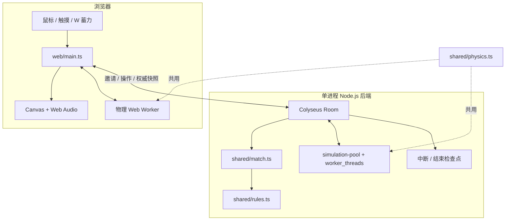
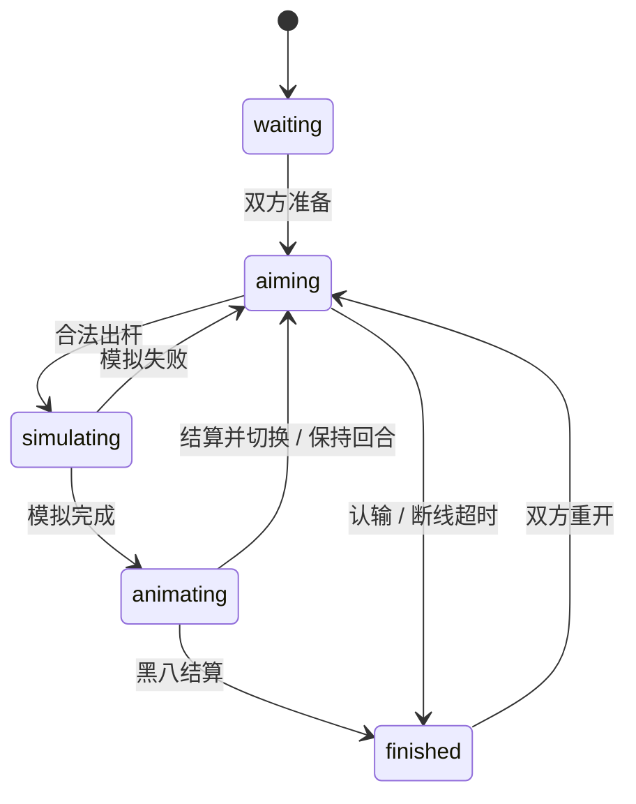

# 架构：同一套球桌，两种运行方式

## 核心取舍

原生 TypeScript + Canvas 负责交互与渲染，避免为单个全屏球台引入 UI 框架。Colyseus 管理双人房与连接，Express 管理 HTTP 边界。计算密集的物理使用 Worker，不阻塞浏览器输入或服务器事件循环。

## 一杆球的生命周期

1. 浏览器记录角度、力度与白球击点，Worker 用 `predict()` 计算双准线。
2. 出杆只发送 `requestId`、`turnVersion` 和三项击球参数。
3. 服务端校验消息、席位、回合与幂等状态，将不可变球位副本交给计算池。
4. 服务端接受模拟结果，广播出杆输入和起始时间；客户端用同一求解器生成动画帧。
5. 动画时间结束，服务器按碰撞、碰库、入袋事件判定犯规、分组和胜负，再广播最终快照。

状态机：

## 双准线不是另一套物理

`predict()` 与实际击球共用 `simulate()`，输入包括力度和击点。金色分支表示目标球方向，蓝色分支表示白球碰撞后的方向。预测窗口和线长有限；下一次碰撞、碰库或入袋会截断路径。无直接目标时不绘制虚假的目标球分支。

模型为休闲平面物理，包含碰撞、库边反弹、滑动和滚动摩擦，以及简化的高低杆。球杆冲量部分改编自 Apache-2.0 的 pooltool；出处、提交及改动见第三方声明。

## 本地单人练习与 Pages Demo

`shared/practice-game.ts` 独立管理单人练习：仅一个玩家，没有倒计时、不调用八球判罚，全部 15 颗目标球入袋即完成。白球落袋后进入摆球状态，也可主动自由摆白球。出杆、动画期间锁定操作，重摆和退出用代次标识丢弃异步结果。练习与同屏双人共用物理 Worker、动画及输入控制。完整版和 Pages 都提供练习入口。

`shared/local-game.ts` 把相同的 `Match` 状态机接到浏览器的物理 Worker。当前回合玩家由同一个页面控制，因此是**同屏双人**而非远程对战，也没有 AI 对手。模拟期间重开或退出时，用代次标识丢弃过期结果。

`npm run build:demo` 显式开启 `VITE_DEMO=true`。Pages 只部署构建后的 `web-dist/`，不上传后端状态、数据目录或密钥。完整版本 `npm run build` 提供单人练习及邀请好友模式。

## 联网边界

- 邀请码保护第二个席位，房间不进入公开匹配列表，最多两名玩家。
- Origin 精确白名单、消息结构/大小校验与频率限制保护 HTTP/WS 入口。
- `turnVersion` 防止旧回合操作，`requestId` 及参数指纹避免重复出杆。
- 断线暂停瞄准倒计时，已接受的击球继续结算；60 秒内可恢复连接。
- 房间在内存里。检查点用于提示中断和结束，不是跨进程续局存档。
- 单实例设计；直接开启多副本无法保证邀请查询和房间在同一进程。扩容前需要共享发现、路由与状态策略。

## 可继续改善的方向

实体手机与 Safari 适配、碰袋模型、弱网体验和可复现的公网容量测试优先于新功能。AI 对手需要候选击球搜索与局面评分；当前没有接入大模型，也不把确定性轨迹预测称为 AI。
