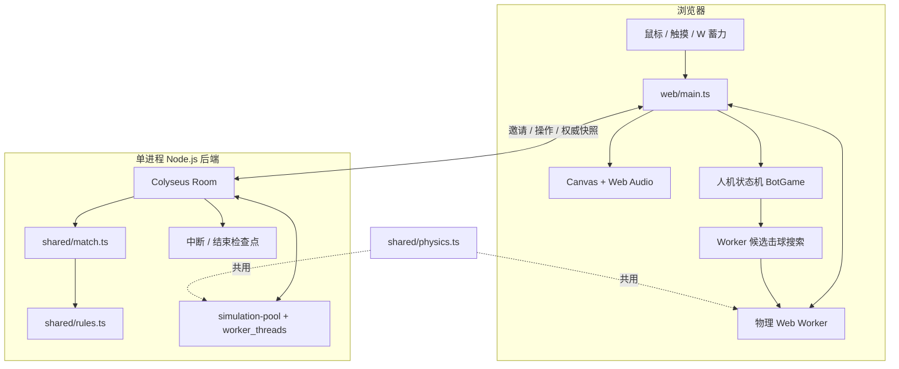
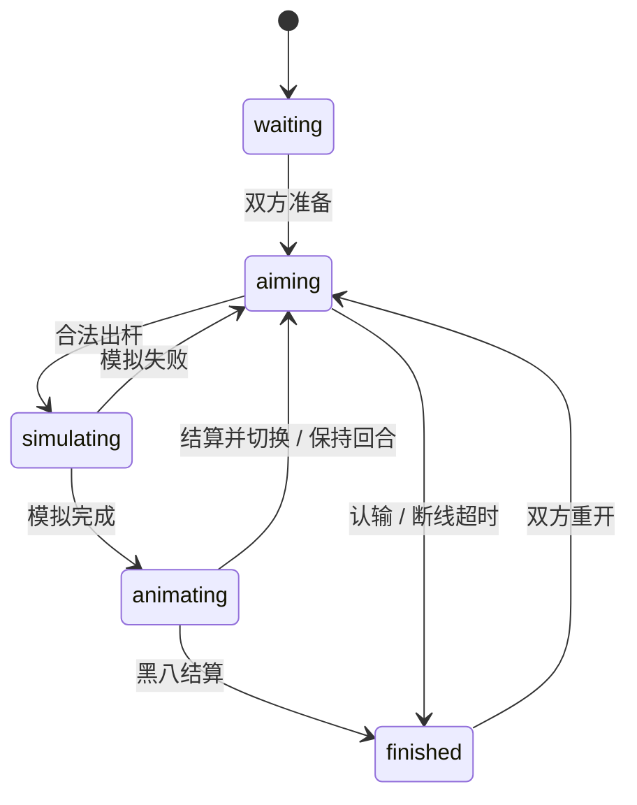

# 架构：同一套球桌，两种运行方式

## 核心取舍

原生 TypeScript + Canvas 负责交互与渲染，避免为单个全屏球台引入 UI 框架。Colyseus 管理双人房与连接，Express 管理 HTTP 边界。计算密集的物理使用 Worker，不阻塞浏览器输入或服务器事件循环。

## 一杆球的生命周期

1. 浏览器记录角度、力度与白球击点，Worker 用 `predict()` 计算双准线。
2. 出杆只发送 `requestId`、`turnVersion` 和三项击球参数。
3. 服务端校验消息、席位、回合与幂等状态，将不可变球位副本交给计算池。
4. 服务端接受模拟结果，广播出杆输入和起始时间；客户端用同一求解器生成动画帧。
5. 动画时间结束，服务器按碰撞、碰库、入袋事件判定犯规、分组和胜负，再广播最终快照。

状态机：

## 双准线不是另一套物理

`predict()` 与实际击球共用 `simulate()`，输入包括力度和击点。金色分支表示目标球方向，蓝色分支表示白球碰撞后的方向。预测窗口和线长有限；下一次碰撞、碰库或入袋会截断路径。无直接目标时不绘制虚假的目标球分支。

模型为休闲平面物理，包含碰撞、库边反弹、滑动和滚动摩擦，以及简化的高低杆。球杆冲量部分改编自 Apache-2.0 的 pooltool；出处、提交及改动见第三方声明。

## 人机对战与 Pages Demo

`shared/bot-game.ts` 用 `Match` 驱动人机对局：人类固定席位 0，电脑固定席位 1。电脑回合自动搜索、摆球、出杆；人类输入仍受回合与版本校验约束。异步决策和模拟用代次、回合版本与阶段校验，重开、认输或退出后的结果不得影响新局。

`shared/bot.ts` 在浏览器物理 Worker 内运行：按球组选合法目标，根据袋口和接触点生成候选角度、力度与击点；最多模拟 54 杆（42 条优先进球候选 + 12 条触球候选），用同一套八球规则评价进球、犯规和胜负。自由球优先选有直线进球机会的合法位置。固定难度，不调用大模型或外部 API；不是专业台球 AI。

`npm run build:demo` 开启 `VITE_DEMO=true`。Pages 只部署 `web-dist/`，默认可玩人机；未配置后端时，好友联机入口明确提示尚未开放，不尝试连接虚假的房间服务。设置仓库 Actions 变量 `VITE_BACKEND_URL` 并重新构建即可接入真实后端。完整版 `npm run build` 默认使用同源后端。

## 联网边界

- 邀请码保护第二个席位，房间不进入公开匹配列表，最多两名玩家。
- Origin 精确白名单、消息结构/大小校验与频率限制保护 HTTP/WS 入口。
- `turnVersion` 防止旧回合操作，`requestId` 及参数指纹避免重复出杆。
- 断线暂停瞄准倒计时，已接受的击球继续结算；60 秒内可恢复连接。
- 房间在内存里。检查点用于提示中断和结束，不是跨进程续局存档。
- 单实例设计；直接开启多副本无法保证邀请查询和房间在同一进程。扩容前需要共享发现、路由与状态策略。

## 可继续改善的方向

实体手机与 Safari 适配、碰袋模型、弱网体验和可复现的公网容量测试优先于新功能。电脑对手后续可增加难度分级、安全球与多库解球。当前采用候选击球搜索，不接入大模型；双准线仍是确定性物理预测。
