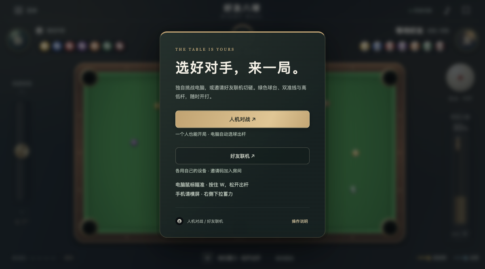
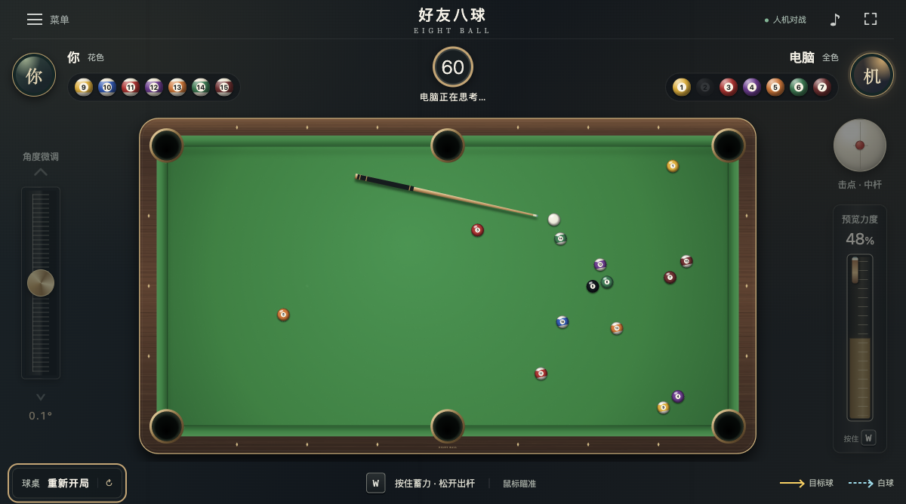
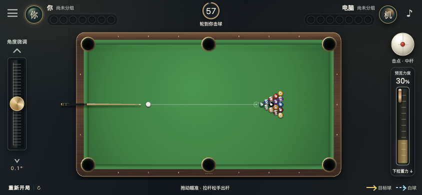

# 前端交付与验收

日期：2026-10-04。当前仅保留 **人机对战 / 好友联机** 两种入口。人机在浏览器内运行；好友联机是两台设备通过邀请码加入同一房间。本次按用户决定暂不部署公网联机后端，Pages 的好友入口显示尚未开放。

## 本地运行

运行 `npm ci`、`npm run dev`，打开 `http://127.0.0.1:5188/`。

- 点击「人机对战」直接开始；首局玩家开球，电脑自动处理自己的回合。
- 点击「好友联机」，一个客户端建房，另一个客户端用邀请码加入，双方准备后开球。实际游玩时两人各用自己的设备。
- 手机局域网联调需要监听局域网地址并配置后端 Origin，见[部署指南](DEPLOYMENT.md)。

## 本次检查

| 检查 | 结果 |
| --- | --- |
| 前后端 TypeScript、完整构建、Pages 构建 | 通过 |
| 自动测试 | 34 项通过，含 8 项电脑策略与人机回合测试、真实 HTTP/WebSocket 双客户端测试 |
| 电脑选球 | 测试覆盖按球组选择合法目标，清完本组后打黑八 |
| 电脑真实进球 | 用实际物理验证直线目标球进袋、合法连续击球与清组后的黑八胜利 |
| 自由球与异步保护 | 自动合法摆球；重开、认输或退出丢弃旧决策和模拟结果 |
| 桌面生产页面人机出杆 | 鼠标向上瞄准、W 蓄力松键后，电脑获得自由球并自动摆球出杆，随后进球继续打 |
| 电脑回合输入锁 | 电脑席位为 1，玩家席位始终为 0；W 不会代替电脑出杆 |
| 手机 844×390 触控模拟 | 右侧拉杆约 53% 出杆，无横向溢出；认输后电脑获胜，重赛由电脑自动开球 |
| 模式切换 | 退出后仅出现「人机对战」「好友联机」，无练习或同屏双人入口 |
| 未配置后端的 Pages 页面 | 进入好友联机显示尚未开放，隐藏建房表单，不请求不存在的房间接口 |
| 两个独立客户端好友联机 | 邀请码加入、席位分别为 0/1；真实 W 出杆后双方 matchId、球位和回合版本一致 |
| 前后端分域接入 | 修复 Colyseus 凭证请求的跨域响应；白名单 Origin 可建房，非白名单仍被拒绝，已补回归断言 |
| 生产调试信息 | 不包含开发诊断钩子 |

原有的鼠标 / 触摸瞄准、左右微调和蓄力、白球上下击点、双准线、音效、认输、自由球及重开逻辑继续使用。人机与联机共用八球规则，双方每回合 60 秒，打开菜单不会暂停计时。

## 截图

下列截图来自实际运行页面，不是 AI 效果图。

## 验证边界

浏览器测试在本机 Chromium / Ego Lite 完成，触控使用浏览器模拟。实体 iPhone、Android、Safari、真实弱网和公网容量仍需实际设备与部署环境验收。

电脑为固定水平的有限候选搜索，不是专业台球 AI；暂不提供难度选择和多库解球搜索。人机进度在刷新或退出后丢失。联网房间保存在单个 Node.js 进程内，后端重启中断对局，不能跨进程恢复。

Dockerfile 已提供，未在 Docker 宿主完成实际构建验收。当前没有新增云函数、收费网关或公网联机服务器。
