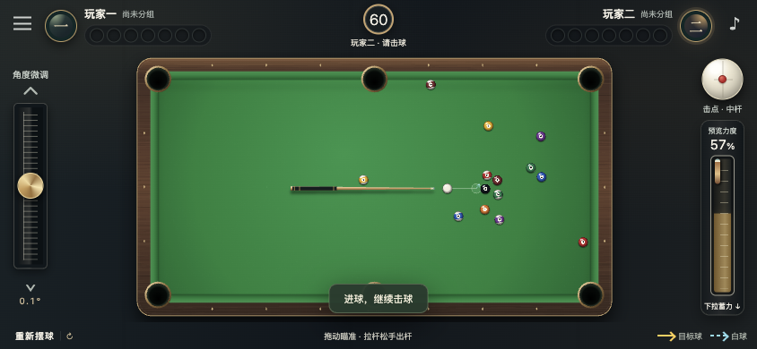

# 前端交付与验收

日期：2026-10-03。完整联网前端已完成本地联调；另增加 GitHub Pages 同屏双人 Demo。公开部署结果以仓库 Actions 和在线 Demo 为准。

## 本地查看

在项目目录运行 `npm ci`、`npm run dev`，打开 **http://127.0.0.1:5188/**。

启动后，两个独立浏览器页面分别填写昵称，一方创建房间，另一方用邀请码加入，双方准备后开球。刷新原页面会尝试使用该标签页保存的重连凭据恢复对局。

桌面使用鼠标瞄准，按住 W 蓄力，松开出杆。手机横屏使用桌面／球杆拖动瞄准、左侧上下微调、右侧下拉蓄力；拉回起点取消，松手击球。点白球上下位置设置高低杆。

本机地址只用于本机浏览器。若在同一 Wi-Fi 下用实体手机验收，可通过 `DEV_HOST=0.0.0.0` 启动，并把电脑的局域网地址（含5188端口）加入 `ALLOWED_ORIGINS`；手机打开该局域网地址。此过程无需 GitHub 或公网发布。当前未自动开放局域网监听。

## 已实现

- 经典绿色台呢、木框金属细节、立体全色／花色球、六袋口、顶部球组与倒计时。
- 真实 Canvas 球台和球杆、双预测分支；Web Worker 共用后端物理，目标线金色，白球线蓝色虚线。
- 邀请码／邀请链接、建房／加入、等待室、双方准备、回合／犯规信息、自由球放置与服务器校验。
- 桌面 W 蓄力与松键击球，手机拉杆、微调、击点；蓄力时锁定瞄准与击点。
- Esc、菜单、失焦、页面隐藏、转屏、触摸取消和回合失效时取消未提交蓄力。
- 出杆确认期间锁定输入，重连后取权威快照；动画插值播放后以服务器球位校准。
- 认输确认、结算、双方同意重开、声音开关、微调灵敏度、规则／操作帮助。
- 手机竖屏提示横屏；保留安全区域、不同宽高比适配；按钮焦点、对话框与键盘焦点约束。
- 自绘球台／球体／控件、程序合成音效，没有复制腾讯美术或音频，也没有将效果图当作游戏背景。

## 已执行的检查

| 检查 | 结果 |
| --- | --- |
| TypeScript 后端／前端检查与前端构建 | 通过；构建主脚本约139KB（gzip约47KB） |
| 生产构建本地预览 | 页面、物理Worker和许可文件加载正常；开发调试钩子未包含 |
| 自动测试 | 28 项通过；包含输入、同屏 Demo 与真实联网测试 |
| 两个真实浏览器页面建房／邀请码加入／双方准备 | 通过；无效邀请显示可恢复提示 |
| 桌面按住 W 松开出杆 | 实际提交力度约61%，双方最终球位完全一致 |
| 非当前回合 W、Esc取消、菜单取消 | 未错误出杆 |
| 手机844×390触控模拟 | 无横向溢出，修复球台尺寸后六袋完整可见 |
| 左侧微调 | 16px拖动在标准灵敏度下改变0.8° |
| 手机低杆与下拉出杆 | 实际传入spin约-0.694，力度约59%；双方球位一致 |
| touchCancel／旋转屏幕 | 已取消蓄力，回合版本不因取消操作变化 |
| 多指与回零 | 第二根手指不改变瞄准或力度；拉回零后松手不出杆 |
| 双准线 | 实际场景中目标球与白球两条分支均生成并显示 |
| 刷新原页面 | matchId及球位不变，恢复连接 |
| Chrome网络离线／恢复 | 前端检测断线并恢复连接 |
| 认输／双方再来一局 | 正确结算，新matchId，16球及击点复位 |

实际运行截图在 `docs/screenshots/`。桌面与手机图来自正在运行的前端，不是AI效果图。

## 需区分的验证边界

本次桌面与触控模拟均在本机 Chromium / Ego Lite 环境完成。帧率读数在已测场景约48–60fps，仅为该机器上的抽样；不代表所有手机。**尚未完成实体 iPhone／Android 触控手感、Safari、移动浏览器工具栏／刘海区和真实弱网验收。** 这些需要用户实际设备体验，不能用桌面模拟替代。

游戏物理继续采用首版平面简化模型：中、高、低杆；无左右塞、跳球和复杂袋角标定。服务器进程重启会中断原局，重新建房；该限制没有被前端改变。

## Pages 试玩与发布适配

- 同屏双人使用共享 Match 状态机，保留进球、分组、自由球、判胜与重开。
- 过期的异步模拟不会覆盖新开的一局；已通过行为测试。
- 完整生产服务同端口提供静态网站、API、/socket HTTP 和 WebSocket；自动测试覆盖真实双客户端及私有文件隔离。
- Dockerfile 提供 Node.js 22 完整前后端镜像，尚未在 Docker 宿主实际构建验收。

本次生产 Demo 实测：桌面 W 蓄力约 47% 后松键成功出杆，动画结束后回合版本更新，玩家切换；未暴露开发诊断钩子。手机 844×390 触摸出杆、重新摆球及无横向溢出由浏览器触控模拟检查。Demo 不请求 /socket、/matchmake 或房间 HTTP 接口。

试玩入口截图：

